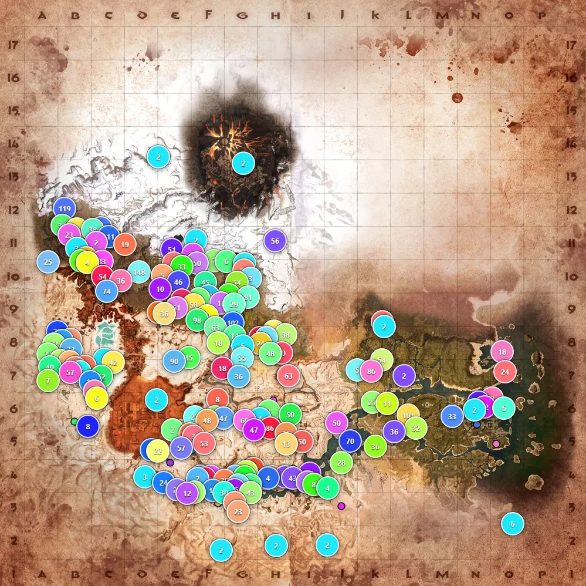

# Conan Exiles Admin Map

[English](README.md) | **Русский**

Админ-панель для серверов Conan Exiles — просмотр игроков, строений и рабов на интерактивной карте.

<p align="center">
  
</p>

## Возможности

- Интерактивная карта с поддержкой обеих карт: **Изгнанники (Exiled Lands)** и **Остров Сиптах (Isle of Siptah)**
- Метки для всех основных типов объектов:
  - Игроки (онлайн выделяются)
  - Питомцы
  - Рабы
  - Постройки (фундаменты)
  - Ремесленные станки
  - Алтари
  - Троны
  - Загоны для животных
  - Спальники / Кровати
  - Костры / Большие костры
  - Сундуки
  - Картографические комнаты
  - Требушеты
  - Хранилища
  - Колодцы
  - Колёса боли
  - Рыболовные ловушки / Ловушки для моллюсков
  - Все объекты Pippi и актёры (Thespians)
- **Мультисерверность** — управление несколькими серверами Conan Exiles из одной панели
- **Кэширование снимков** — данные загружаются по запросу (кнопка «Обновить»); сервер никогда не читает `game.db` автоматически
- **Доступ по пользователям** — каждый аккаунт можно ограничить конкретными серверами
- **Глобальный поиск** (Ctrl+F) — найти любую метку по имени
- **Список строений / кланов** — гильдии с числом построек и индикаторами активности
- **Тултипы меток** с бейджами тира/альфы и командой `TeleportPlayer` в один клик
- Фильтрация меток по кланам (множественный выбор)
- Переключение между картами Изгнанников и Острова Сиптах
- Тёмный интерфейс
- Быстрая загрузка тайлов (WebP) и долгое кэширование в браузере
- Защита паролем через файл конфигурации (Basic Auth)
- **Иконка в системном трее** — остановить сервер без диспетчера задач
- **Автозапуск браузера** при старте

## Установка

1. Скачайте последний `.zip` со страницы [Releases](https://github.com/Myp3uK/ConanMap/releases).
2. Распакуйте в любое удобное место (рядом с `game.db` находиться **не обязательно**).
3. Отредактируйте `conan-exiles-admin-map.ini` — укажите пути к базам, порт, язык и при необходимости учётные данные.
4. Запустите `conan-exiles-admin-map.exe` — браузер откроется автоматически, появится иконка в трее.
5. Нажмите кнопку **Серверы** (🖥) в боковой панели, затем **Обновить**, чтобы загрузить данные из базы.
6. Для остановки используйте иконку в трее → **Stop server** (или закройте через диспетчер задач).

### Конфигурация (`conan-exiles-admin-map.ini`)

#### Один сервер (минимально)

```ini
[SETTINGS]
language     = ru          ; ru, en или es
host         = 127.0.0.1   ; 127.0.0.1 = только локально, 0.0.0.0 = все интерфейсы
port         = 3001
auto_refresh = 300         ; секунд между автообновлениями данных (0 = выключено)

[SERVER_server1]
name             = Мой сервер
database         = C:/ConanExiles/Saved/game.db
```

#### Несколько серверов + вход администратора

```ini
[SETTINGS]
language     = ru
host         = 127.0.0.1
port         = 3001
auto_refresh = 300

[SERVER_pve]
name             = PvE сервер
database         = C:/Servers/pve/game.db

[SERVER_pvp]
name             = PvP сервер
database         = C:/Servers/pvp/game.db

[AUTH]
; Админ-аккаунты. Просмотр карты ПУБЛИЧНЫЙ; вход открывает админ-функции
; (расстановка кастомных меток). ОБЯЗАТЕЛЬНА — без валидной записи запуск не пройдёт.
; Значение — scrypt-хеш; сгенерируйте командой:  npm run set-password <пароль>
admin   = scrypt$<salt>$<hash>
admin2  = scrypt$<salt>$<hash>
```

**Примечания:**
- `host` по умолчанию `127.0.0.1` (только локально). Используйте `0.0.0.0` для всех интерфейсов или оставьте локально и публикуйте через обратный прокси — см. [docs/caddy.md](docs/caddy.md).
- `auto_refresh` задаёт, как часто автоматически перечитывается `game.db` (в секундах; `0` — выключено). Кнопки ручного обновления в интерфейсе нет.
- `admin_guilds` — маски имён гильдий через запятую (SQL `LIKE`: `%` — любые символы, `_` — один), чьи постройки считаются защищёнными и не показывают таймер ветшания. По умолчанию: `%ADMIN%,%Админ%`.
- **Секция `[AUTH]` обязательна.** Просмотр публичный; вход (cookie-сессия) открывает админ-функции. Хеши паролей генерируются командой `npm run set-password <пароль>` (политика: ≥16 символов со строчными, заглавными и цифрой). Пароль в открытом виде нигде не хранится.
- Игровая база (`game.db`) — только для чтения. Кастомные метки админов хранятся отдельно в `markers/<server>.json`.
- Старая секция `[CONAN_EXILES]` всё ещё поддерживается для обратной совместимости (трактуется как один сервер `server1`).

### Как работает загрузка данных

Приложение **не** перечитывает `game.db` при каждом открытии страницы. Вместо этого:

1. При старте данные каждого сервера читаются один раз и кэшируются как снимок в папку `snapshots/`, поэтому рестарты мгновенные.
2. Если задан `auto_refresh`, снимок автоматически обновляется из `game.db` с этим интервалом.
3. Интерфейс читает кэшированный снимок; кнопки ручного обновления нет. Выберите сервер в панели **Серверы** (🖥), чтобы посмотреть его данные.

## Источник

Этот проект — форк [Evrard-ro/conan-exiles-admin-map](https://github.com/Evrard-ro/conan-exiles-admin-map),
который, в свою очередь, является форком оригинального [germanrcuriel/conan-exiles-admin-map](https://github.com/germanrcuriel/conan-exiles-admin-map)
авторства Germán Robledo Curiel. Распространяется по лицензии MIT — см. [LICENSE](LICENSE).

## Разработка

Требования: Node.js 24+

```bash
npm install
npm start        # транспиляция + запуск через babel-node на порту 3001
npm test         # запуск тестов
```

Перед запуском положите `conan-exiles-admin-map.ini` в корень проекта (или укажите путь к реальному `game.db`).

### Сборка Windows .exe

Требуется bash / WSL:

```bash
npm run build    # на выходе build/conan-exiles-admin-map-vX.Y.Z.zip
```

После сборки отредактируйте `build/conan-exiles-admin-map.ini`, указав в `database` путь к вашему `game.db`, прежде чем запускать exe.

## История изменений

Полный список изменений — в [CHANGELOG.ru.md](CHANGELOG.ru.md).
